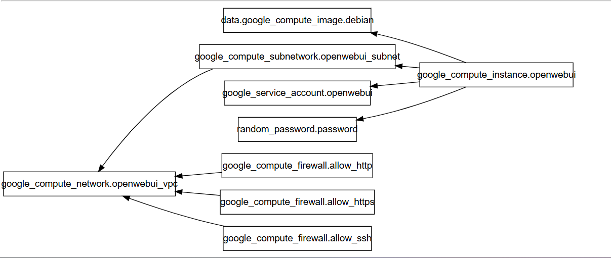

# 🚀 Deploy Open Web UI on GCP with Terraform

This Terraform module provisions a Google Cloud Platform (GCP) virtual machine and installs **[Open Web UI](https://github.com/open-webui/open-webui)** using Docker. It supports optional GPU acceleration and integrates with the OpenAI API.

## 🏗️ Architecture



The diagram above shows the relationship between all Terraform resources in this project, including:
- VM Instance
- VPC Network and Subnet
- Firewall Rules
- Service Accounts
- Storage and Compute Resources

---

## 📦 Features

- ✅ Supports both **CPU** and **GPU**-enabled VM types  
- 🔐 Generates a secure random admin password  
- 🐳 Installs and configures Docker and Open Web UI  
- 🔑 Sets up SSH and HTTP/HTTPS firewall rules  
- 🌐 Optionally connects to OpenAI API for extended functionality  
- ☁️ Uses a custom GCP service account and startup provisioning script  
- 🔒 NGINX reverse proxy with SSL and automatic HTTPS redirection
- 💾 Persistent storage for user data and configurations

---

## 📋 Prerequisites

- Terraform ≥ 1.4.0  
- GCP account with billing enabled  
- GCP project and service account with the following roles:  
  - `Compute Admin`  
  - `Service Account User`  
  - `Storage Admin` (if needed)  
- A valid OpenAI API key (optional)  
- SSH key pair (`id_rsa.pub` for VM login)  

---

## 📁 Project Structure

```plaintext
.
├── main.tf                    # Main Terraform configuration
├── variables.tf               # Input variables
├── outputs.tf                 # Output values (IP, URLs)
├── providers.tf               # Provider configuration
├── vm.tf                      # VM instance configuration
├── vpc.tf                     # Network configuration
├── firewall.tf               # Firewall rules
├── scripts/
    ├── provision_basic.sh     # Basic startup script
    └── provision_vars.sh      # Main provisioning script
└── README.md                  # Documentation
```

## ⚙️ Setup Instructions

1. 📁 **Prepare Your Environment**

    ```bash
    git clone <repository-url>
    cd <project-directory>
    ```

2. 🔑 **Create or Obtain GCP Credentials**

    - Go to [Google Cloud Console](https://console.cloud.google.com/)
    - Create a service account with required roles
    - Download JSON credentials
    - Save as `credentials.json` in project directory

3. 📄 **Configure Variables**

    Create `terraform.tfvars`:

    ```hcl
    project_id           = "your-gcp-project-id"
    region              = "us-east1"
    zone                = "us-east1-b"
    gcp_credentials_file = "./credentials.json"
    openai_key          = "sk-..."                    # Optional
    openai_base         = "https://api.openai.com/v1" # Optional
    gpu_enabled         = false                       # Set true for GPU VM
    ssh_pub_key         = "./id_rsa.pub"
    ```

4. 🔑 **Generate SSH Keys** (if needed)

    ```bash
    ssh-keygen -t rsa -b 4096 -f id_rsa
    ```

5. 🚀 **Deploy Infrastructure**

    ```bash
    terraform init
    terraform fmt
    terraform validate
    terraform plan
    terraform apply
    ```

6. 🌐 **Access Open Web UI**

    After successful deployment:
    - Open `https://<VM_IP>` in your browser
    - Login with:
      - Username: `admin@demo.gs`
      - Password: Get from `terraform output password`

## 🔧 Maintenance & Troubleshooting

### Checking Services
```bash
# SSH into the VM
ssh -i id_rsa openwebui@$(terraform output -raw public_ip)

# Check service statuses
sudo systemctl status docker
sudo systemctl status nginx
sudo systemctl status openwebui
sudo docker ps

# View logs
sudo journalctl -u openwebui
sudo cat /var/log/provision.log
sudo nginx -t
```

### Common Issues

1. **Startup Script Issues**
   - Check logs: `sudo cat /var/log/syslog | grep startup-script`
   - View provision log: `sudo cat /var/log/provision.log`

2. **Docker Container Issues**
   - Check container logs: `sudo docker logs openwebui`
   - Restart service: `sudo systemctl restart openwebui`

3. **NGINX/SSL Issues**
   - Test config: `sudo nginx -t`
   - Check logs: `sudo tail -f /var/log/nginx/error.log`
   - Restart NGINX: `sudo systemctl restart nginx`

4. **Access Issues**
   - Verify firewall rules in GCP console
   - Check NGINX configuration
   - Ensure services are running

## 🧹 Cleanup

To remove all created resources:

```bash
terraform destroy
```

## 🔒 Security Notes

- Change default credentials after first login
- The default SSL certificate is self-signed
- Consider restricting firewall rules to specific IP ranges
- Keep your SSH private key secure

## 📝 Additional Notes

- The VM uses Debian 11 (Bullseye) as base image
- Default disk size is 200GB
- NGINX is configured as a reverse proxy with SSL
- Data persists in `/etc/open-webui.d/`
- Automatic HTTPS redirection is enabled

## 🤝 Contributing

Contributions are welcome! Please feel free to submit a Pull Request.

